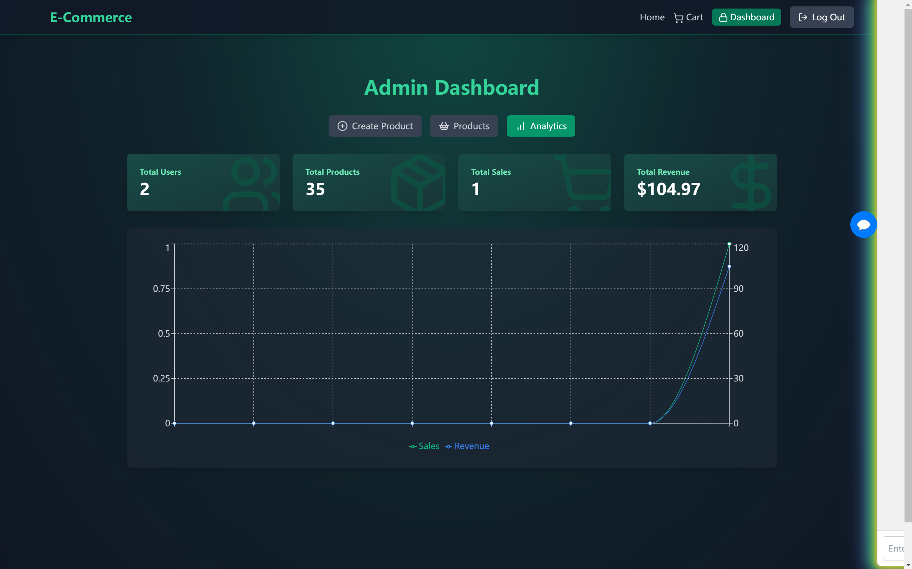

# E-commerce-System-Based-on-AI-Agent

Welcome to **E-Commerce System** – a cutting-edge, full-featured online shopping solution built for seamless user experiences, efficient management, and powerful AI capabilities. This project integrates modern technologies and tools like MongoDB, Redis, Stripe, and OpenAI to offer an optimized, high-performance e-commerce platform. Whether you're shopping for products or managing a store, this platform is designed to meet the demands of both users and administrators.

### 😊Learn more about me:

Welcome to my homepage, feel free to click the link below!

[Click here to visit my homepage](http://guonazhi.site)

---
## 🚀 Key Features

### 🛠️ Full Stack Integration
- **MongoDB**: A NoSQL database solution for scalable data storage.
- **Redis**: In-memory data structure store used for caching, speeding up requests, and enhancing performance.
- **Stripe**: Secure and reliable payment processing system for seamless transactions.
- **Tailwind CSS**: Responsive, utility-first CSS framework for fast and beautiful UI design.

---
### 🧠 AI Agent
- **AI Assistant** powered by OpenAI: Helps users solve problems, answer queries, and recommend products based on their preferences and browsing history.
- Seamless integration with the e-commerce platform to provide personalized recommendations and improve user engagement.

---
### 💳 Stripe Payment Setup
- Secure and easy checkout with **Stripe**, enabling fast payment processing.
- Supports various payment methods like credit/debit cards, digital wallets, etc.
- Ensures PCI-compliant and secure transactions.

### 🛒 Core E-Commerce Features
- **Product & Category Management**: Easy admin interface to add, update, and categorize products.
- **Shopping Cart**: Users can add items to the cart and view/edit their selections.
- **Checkout Process**: Integrates with Stripe to handle payments and confirm orders.
- **Coupon Code System**: Admins can create discount codes for promotional purposes.
  
### 🚀 Redis Caching
- **Redis** integration boosts site speed by caching frequently accessed data.
- Reduces load on databases, improving the user experience by reducing latency.

### 📊 Sales Analytics
- Admin dashboard displays detailed insights into sales performance.
- Includes charts, graphs, and data points for easy tracking of revenue, orders, and user behavior.

---

## 🌟 Technologies Used

- **Frontend**: React, Tailwind CSS
- **Backend**: Node.js, Express
- **Database**: MongoDB
- **Caching**: Redis
- **Authentication**: JWT
- **Payment Gateway**: Stripe
- **AI**: OpenAI API

---
